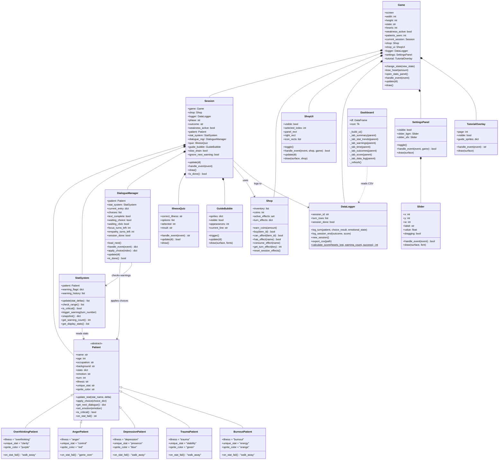

# UML Class Diagram — Soft Hours

> **Submission note:** the official submission UML is [`UML.pdf`](UML.pdf) at the project root. This `.md` file is a text source you can keep updated alongside the code — paste the Mermaid block below into <https://mermaid.live> to re-render and export a fresh PDF.

## Relationship summary

| Relationship | Type | Description |
|---|---|---|
| `Patient → 5 subclasses` | Inheritance | Every concrete patient inherits from `Patient` and overrides `on_stat_fail()`. |
| `Game → Session/Shop/ShopUI/DataLogger/SettingsPanel/TutorialOverlay` | Composition | `Game` owns these — they live and die with the Game. |
| `Session → Patient/StatSystem/DialogueManager/IllnessQuiz/GuideBubble` | Composition | Session owns its per-patient subsystems. |
| `Session → Shop / DataLogger` | Association (uses) | Borrowed from Game rather than owned. |
| `StatSystem → Patient` | Association | Reads stats and updates flags. |
| `DialogueManager → Patient / StatSystem` | Association | Calls `apply_choice` / `check_range`. |
| `Dashboard ..> DataLogger CSV` | Dependency | Reads the file produced by DataLogger. |
| `SettingsPanel *-- Slider` | Composition | Settings panel owns two Slider instances. |
