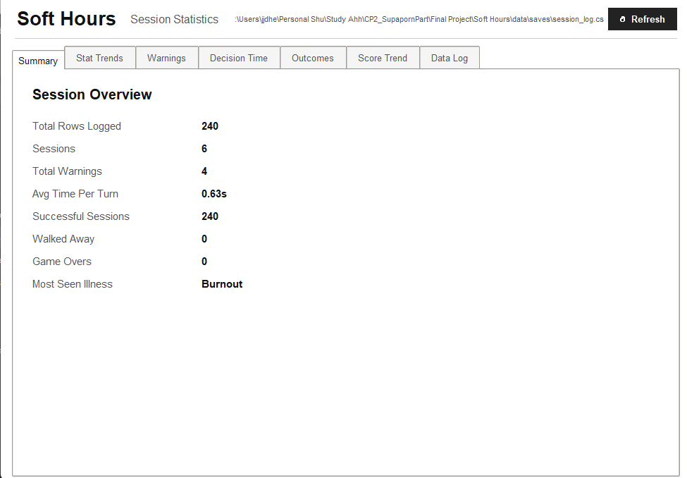
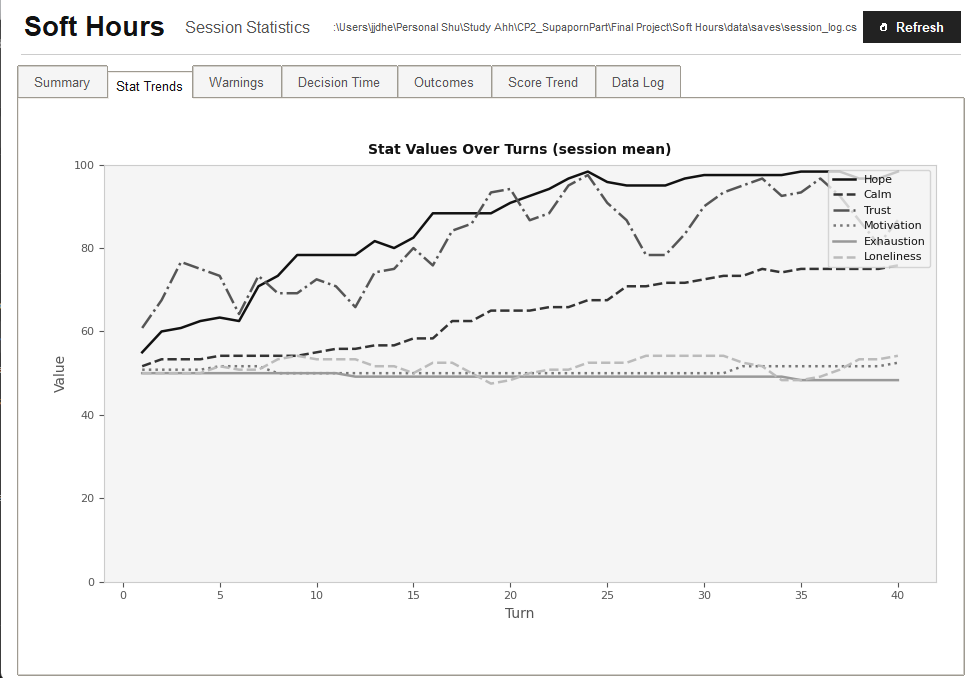
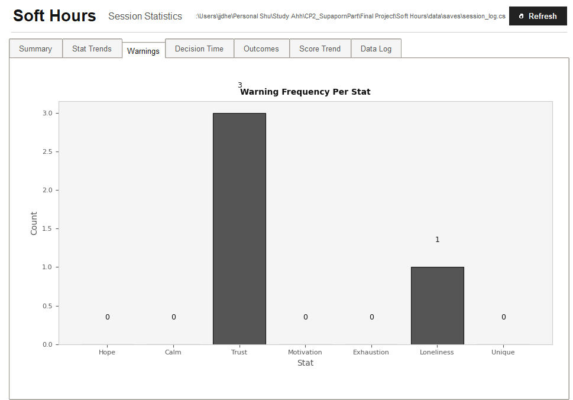
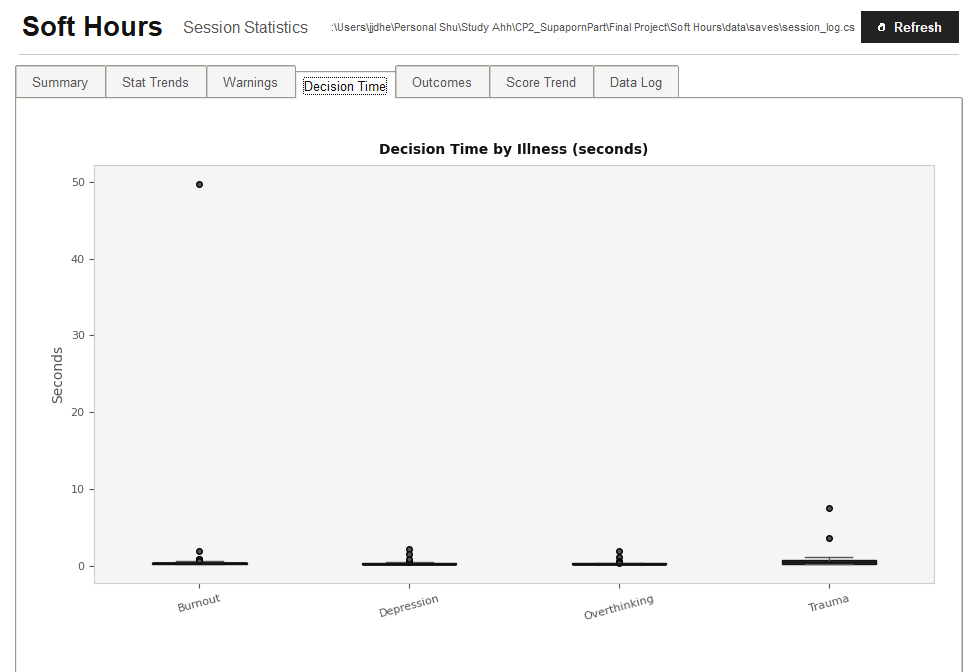
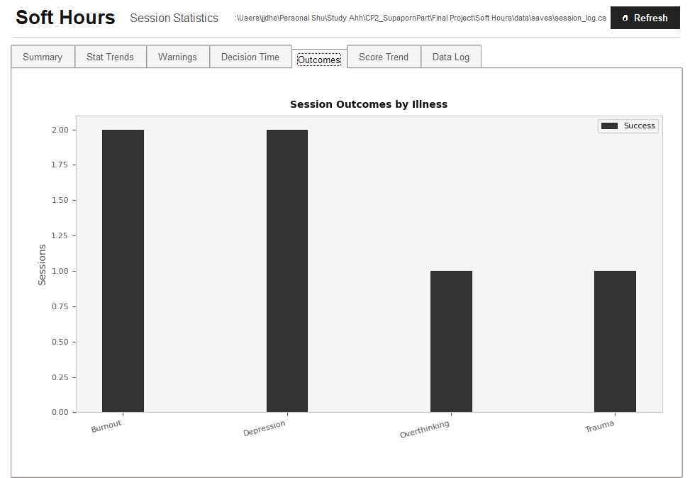
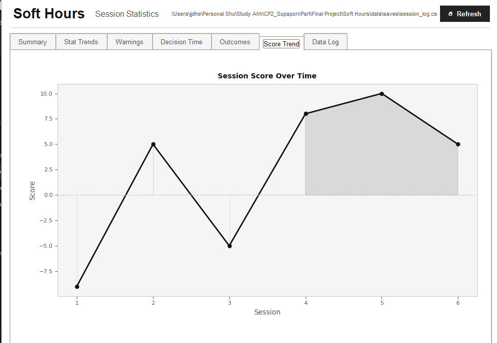
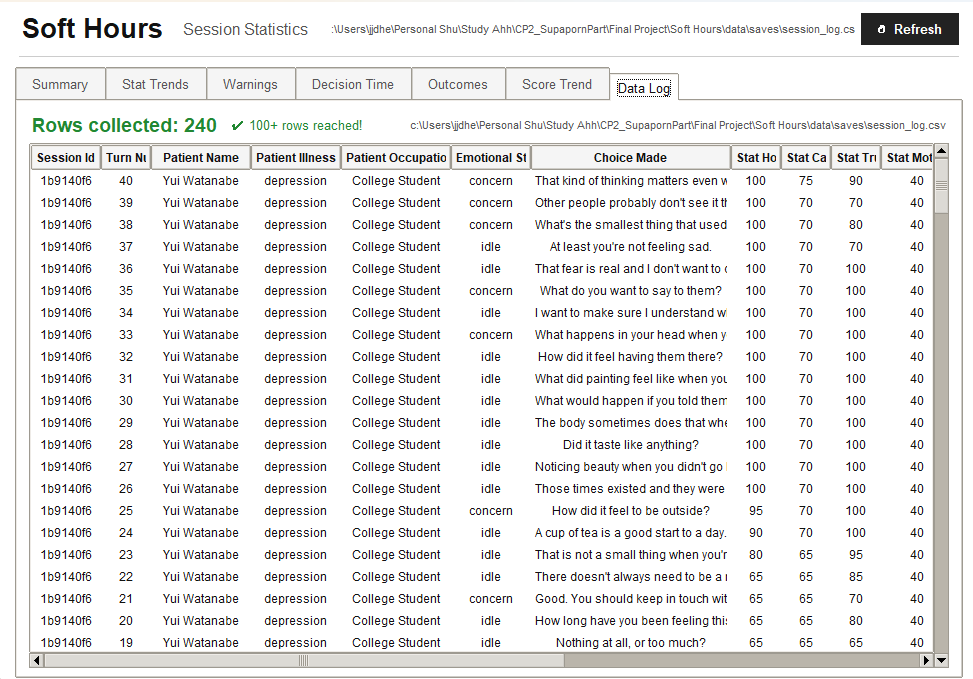

# Data Visualization

This document covers every data-related part of the Soft Hours statistics dashboard. The dashboard is built with **Tkinter** + **matplotlib** and reads from `Soft Hours/data/saves/session_log.csv`. It's launched in a separate process from the in-game **Settings → Stats** button so it doesn't block the Pygame main loop.

The dashboard is laid out as a `ttk.Notebook` with **7 tabs**, each shown below.

---

## Tab 1 — Summary

The Summary tab is a quick-glance overview of the current dataset. It shows total rows logged, total distinct sessions (one per patient visit, thanks to the per-session UUID), total warnings triggered, average decision time per turn in seconds, the count of successful sessions, walked-away sessions, and game-overs, and the most-seen illness across the whole dataset. This is the first thing you see when the dashboard opens, and it doubles as a sanity check that data collection is actually working end-to-end.

---

## Tab 2 — Stat Trends (Line Graph)

This line graph plots the mean stat value across all sessions for each turn number on the X-axis. Six lines are shown — Hope, Calm, Trust, Motivation, Exhaustion, Loneliness — using grayscale colors and varied line styles so they stay distinguishable in print. The Y-axis is fixed to 0–100 to match the stat range. This view answers the question *"as turns go by, how do average stats trend across all my sessions?"* — it makes it easy to spot whether any stat tends to decay (or spike) over the course of a typical session.

---

## Tab 3 — Warnings (Bar Graph)

A bar chart counting how many turns each stat spent in the danger zone across the entire CSV. Positive stats (Hope, Calm, Trust, Motivation, the unique stat) are counted when their value `<= 20`; pressure stats (Exhaustion, Loneliness) are counted when their value `>= 80`. Each bar is annotated with its exact count. This identifies the **most neglected stat** at a glance — you can see which stat keeps slipping and adjust your dialogue choices the next time around.

---

## Tab 4 — Decision Time (Boxplot)

A boxplot grouping `time_per_turn` (in seconds) by `patient_illness`. Each illness gets its own box with whiskers and outlier markers, and the Y-axis is in seconds. This view reveals which patient archetype causes the most hesitation — for example, a wide box on Trauma means the player took variable time on those choices, while a tight box on Burnout means fast, confident answers. It's useful for understanding the *felt* difficulty of each illness type beyond the raw outcome stats.

---

## Tab 5 — Outcomes (Grouped Bar Graph)

A grouped bar chart showing the count of each session outcome (`success`, `walked_away`, `game_over`) broken down by illness type. Each illness has up to three bars (one per outcome) in different shades of gray with hatching patterns for accessibility. This makes it visually obvious which patient types you've been handling well and which ones tend to fail — a lot of `walked_away` bars on Depression but mostly `success` on Overthinking, for example, would point at a clear difficulty asymmetry.

---

## Tab 6 — Score Trend (Line Graph)

A line graph plotting `session_score` over time. The X-axis is the session run number (1, 2, 3, …) and the Y-axis is the computed score (`+10` for success, `−5` per heart lost, `−2` per warning). A horizontal dashed line at zero separates positive from negative scores. The area is lightly filled — gray above zero, red below. This view tells you whether you're **getting better across runs** — a rising trend means you're managing patient stats more cleanly, while a flat or falling trend means there's room to grow.

---

## Tab 7 — Data Log (Raw Table)

A scrollable raw-data table built with `ttk.Treeview` showing the last 500 CSV rows in reverse chronological order. Each row in the table corresponds to one row in `session_log.csv`. Columns include `session_id`, `turn_number`, `patient_name`, `patient_illness`, `patient_occupation`, `emotional_state`, `choice_made`, all 7 stat columns, `warning_triggered`, `time_per_turn`, `session_outcome`, and `session_score`. Rows where `warning_triggered = 1` are highlighted in **amber** for fast scanning. A row-count indicator at the top turns green once the dataset reaches the 100-row goal — this is the primary verification surface for the data-collection requirement.

---

## Statistical measures computed

| Measure | Where it appears |
|---|---|
| **Mean** | Avg Time Per Turn (Summary), mean stat values per turn (Stat Trends) |
| **Median** | Center line of each box (Decision Time boxplot) |
| **Min / Max** | Box whiskers (Decision Time), Y-axis bounds (Score Trend) |
| **Frequency Count** | Warning counts (Warnings), outcome counts (Outcomes), session counts (Summary) |
| **Mode** | Most-seen illness (Summary) |

Every chart auto-refreshes when you click **↺ Refresh** at the top of the dashboard, which re-reads the CSV and rebuilds every tab. The window can be resized freely.
